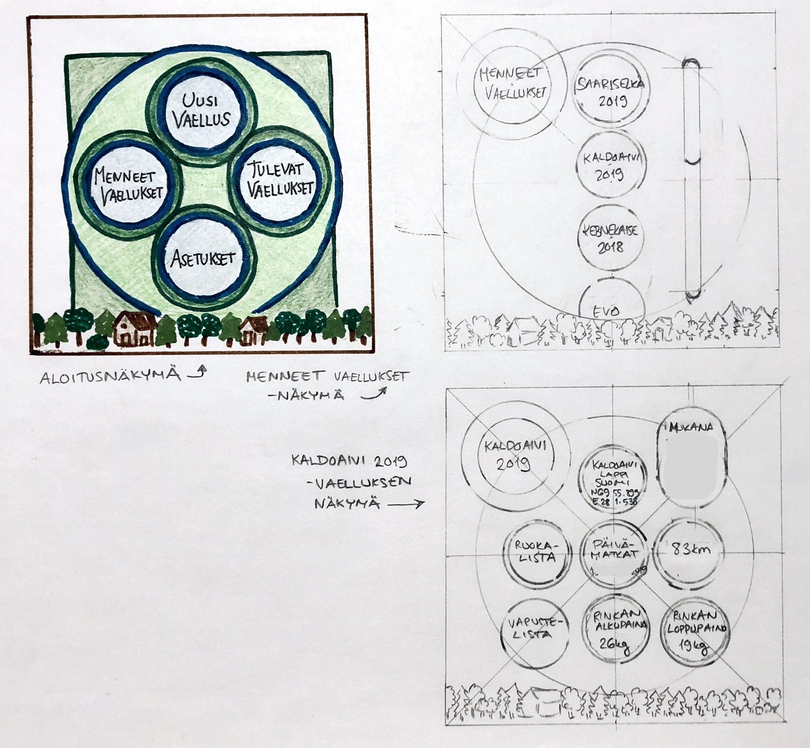

# Vaatimusmäärittely

## Sovelluksen tarkoitus
Vaelluspäiväkirjan avulla käyttäjä voi pitää kätevästi kirjaa menneiden ja tulevien vaellusreissujensa reiteistä ja päivämatkoista. Lisäksi sovellukseen voi tallentaa esimerkiksi tiedon matkaseuralaisista, rinkan alku- ja loppupainosta, päiväkohtaisesta säästä sekä vaelluksen ruoka- ja varustelistat. Sovelluksessa näkee helposti sekä tekemiensä vaellusten tiedot, joita voi hyödyntää seuraavia vaelluksia suunnitellessa, että tulevat vaellussuunnitelmansa.  

## Käyttäjät
Sovelluksen käyttäjien käyttäjärooli on lähtökohtaisesti _tavallinen käyttäjä_.

## Käyttöliittymäluonnos
Aloittaessaan sovelluksen käytön ensimmäistä kertaa käyttäjä luo itselleen käyttäjänimen, jota pääsee myöhemmin muokkaamaan _Asetuksista_. Tämän jälkeen sovellus aukeaa aloitusnäkymässä, missä se aukeaa jatkossakin sovellusta käynnistettäessä.

Aloitusnäkymästä pääsee luomaan uuden vaelluksen sekä navigoimaan menneiden vaellusten listaukseen, tulevien vaellusten listaukseen ja _Asetuksiin_. Menneiden ja tulevien vaellusten listauksissa käyttäjä voi valita tarkasteltavaksi jonkin tietyn vaelluksen. Kun jokin tietty vaellus valitaan, aukeaa uusi näkymä, jossa on ko. vaellukseen tallennetut tiedot. Osa tiedoista, esimerkiksi ruoka- ja varustelistat, ovat linkkejä seuraaviin näkymiin. 

Alla olevassa luonnoskuvassa on esitelty kolme näkymää: aloitusnäkymä, menneiden vaellusten listaus ja valitun vaelluksen tiedot esittelevä näkymä.

## Perusversion tarjoama toiminnallisuus

Vaelluspäiväkirjan perusversiossa käyttäjä voi luoda, muokata ja selata vaelluksiaan, jotka on ryhmitelty menneisiin ja tuleviin vaelluksiin ja järjestetty alkamispäivän mukaan _(toteutettu)_. Käyttäjä voi myös selata, luoda ja muokata varuste- ja ruokalistoja sekä liittää näitä vaelluksiinsa. Ruokalistoihin tallennettuja yksittäisiä ruokalajeja voi liittää myös yksittäisiin päivämatkoihin. _(ei vielä käytettävissä)_

### Vaellus

Vaellus koostuu
* päivämatkoista, joita on vähintään yksi vaellusta kohti (päivämatka on järjestetty päivämäärän mukaan) _(ei vielä käytettävissä)_
* kohteesta (paikannimi, toimii myös vaelluksen nimenä) _(toteutettu)_
* varustelistasta _(ei vielä käytettävissä)_
* ruokalistasta _(ei vielä käytettävissä)_
* seuralaisista (kanssavaeltajien nimiä) _(toteutettu)_ sekä
* rinkan alku- ja loppupainosta. _(toteutettu osittain)_
* Käyttäjä voi valita, mitkä tiedot hän tallentaa.

### Päivämatka
_(ei vielä käytettävissä)_
Päivämatkalla on
* päivämäärä
* alku- ja loppupisteet (käyttäjän valinnan mukana nimiä tai koordinaatteja)
* kuljettu matka (km) 
* kävelyaika (tunteja ja minuutteja) sekä
* mahdollisesti päiväkohtaiset ruokalajit.
* Lisäksi on päivämatkalle on mahdollista kirjoittaa (lyhyt) kuvaus päivän säästä.
* Käyttäjä voi valita, mitkä tiedot hän tallentaa.

### Varuste- ja ruokalistat
_(ei vielä käytettävissä)_
Käyttäjä voi luoda varustelistoja, jotka tallentavat listan vaellukselle mukaan otettavista varusteista. Samaan tapaan käyttäjä voi luoda myös ruokalistoja, jotka tallentavat vaellukselle suunnitellut ruokalajit. Ruokalajien kohdalle voi merkitä vaelluspäivän, jolle se on suunniteltu. Saman varuste- tai ruokalistan voi liittää useampaan vaellukseen, ja listoja voi myös muokata.

### Asetukset
Aloittaessaan sovelluksen käytön käyttäjä luo itselleen käyttäjänimen, joka voi olla käyttäjän oma nimi tai itse keksitty nimimerkki. Nimen voi vaihtaa asetuksissa.

## Jatkokehitysideoita
Myöhemmin sovellukseen lisättäviä toiminnallisuuksia voivat esimerkiksi olla 
* käyttäjäprofiilin laajentaminen (mm. profiilikuva, ikä) ja
* käyttäjien välinen kommunikointi.
