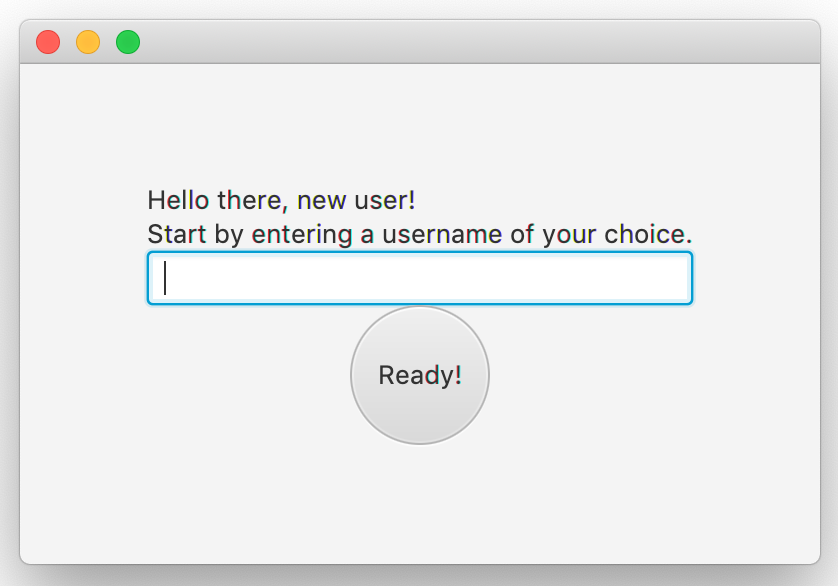
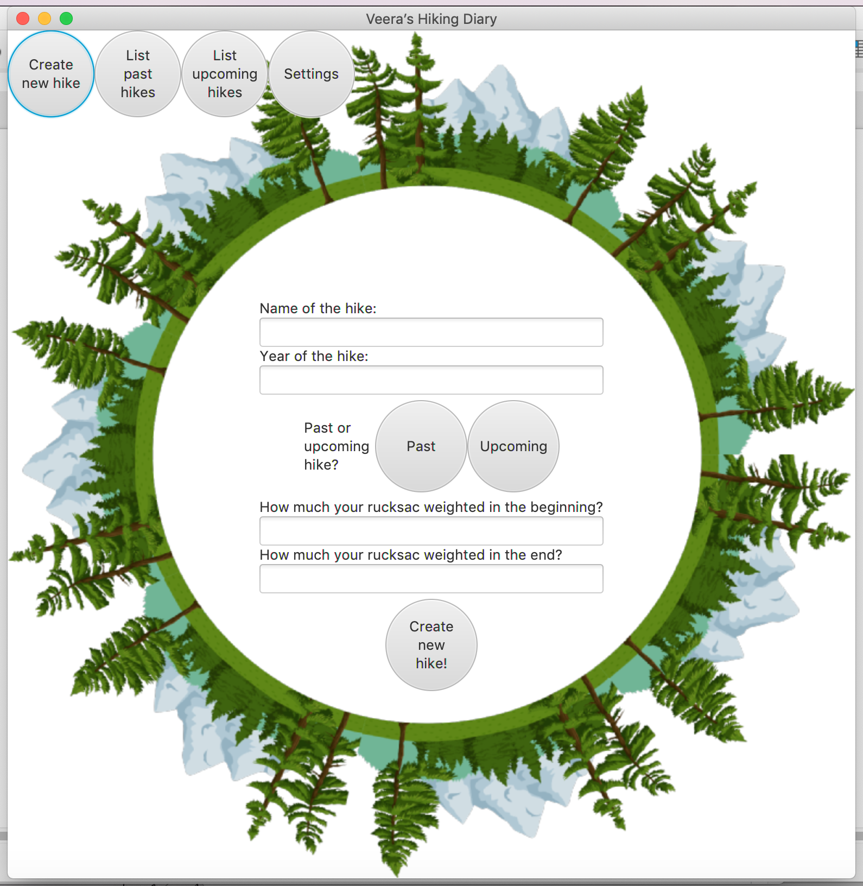
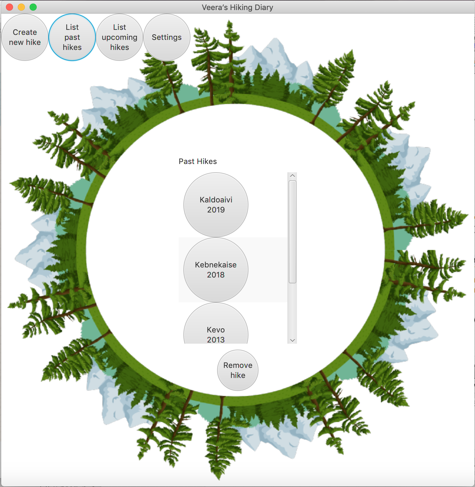
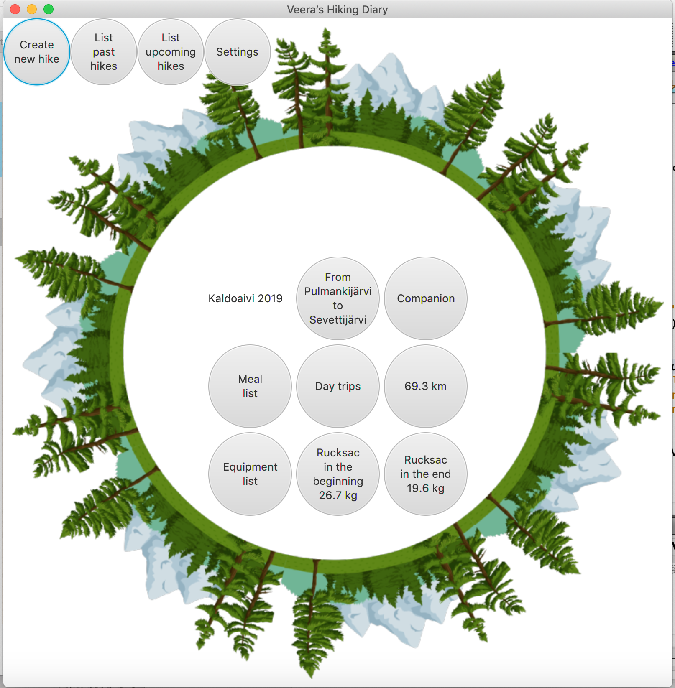
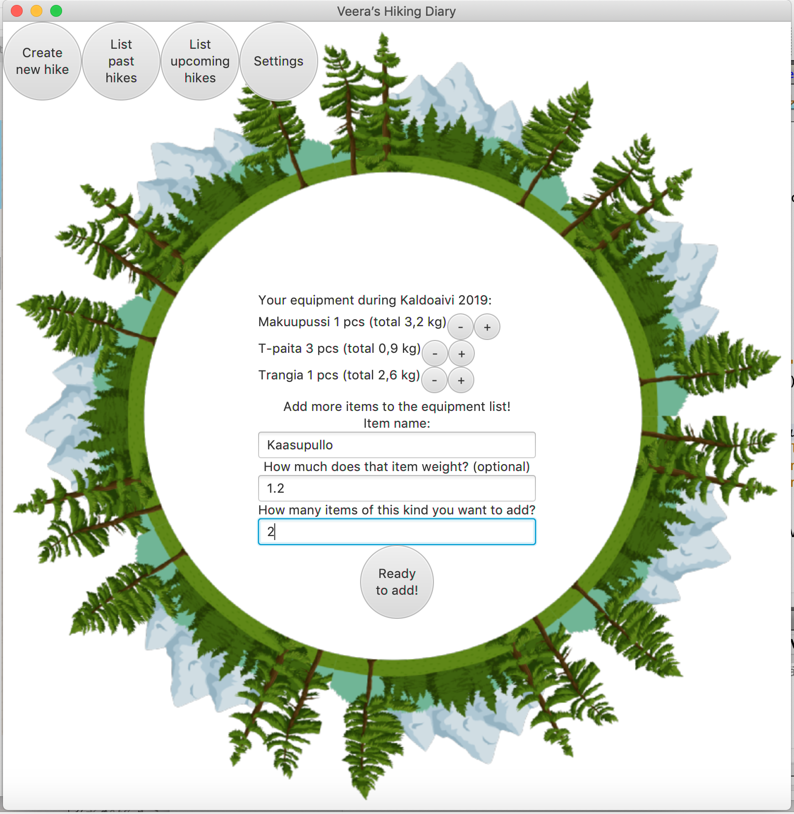
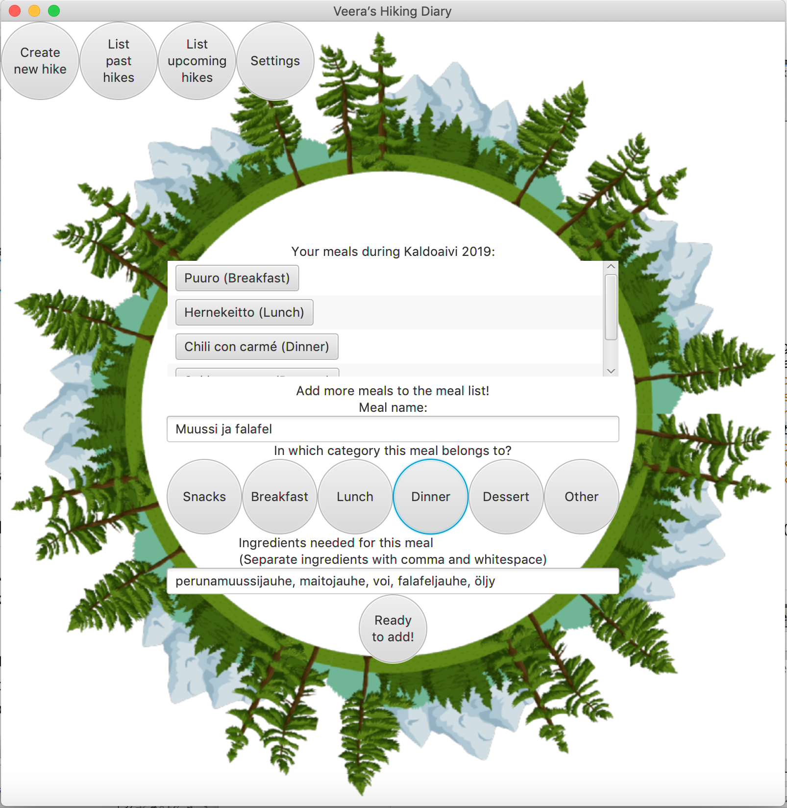
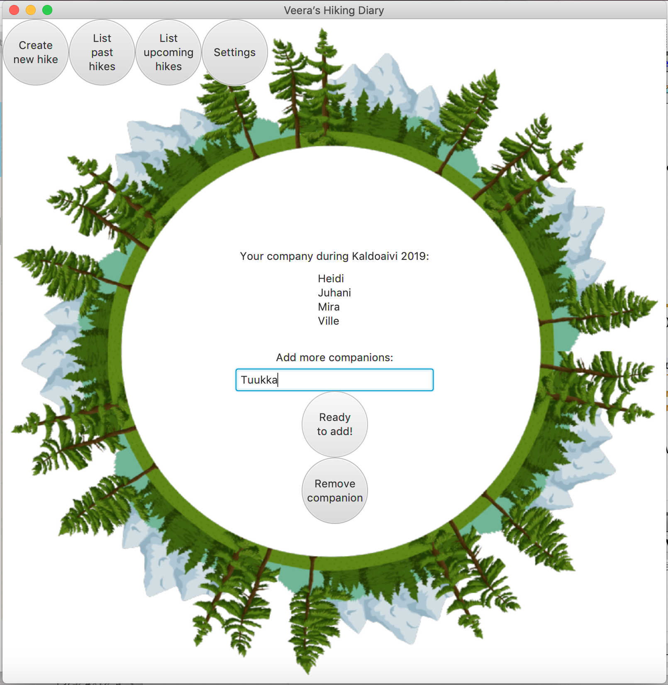
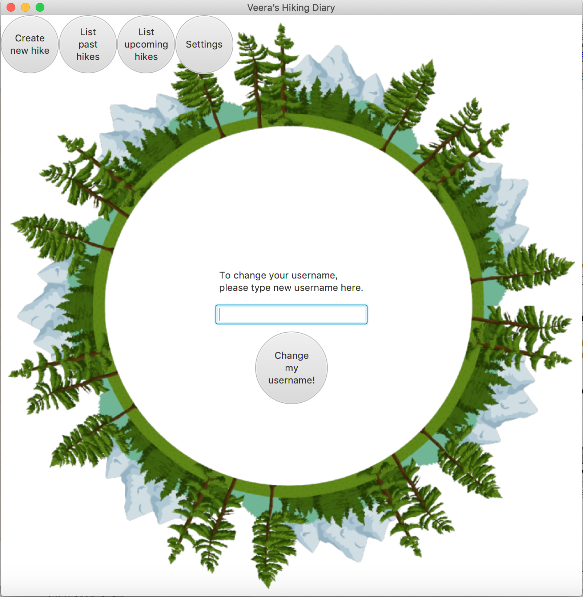

# Käyttöohje

Sovelluksen käyttäminen aloitetaan latamaalla tiedosto vaelluspaivakirja.jar.

## Sovelluksen käynnistäminen

Kun tiedosto on ladattu, ohjelma käynnistetään komennolla

```
java -jar Vaelluspaivakirja-1.0.jar
```

Kun sovellusta käytetään ensimmäistä kertaa, avautuu aluksi näkymä, jossa käyttäjän tulee valita itselleen haluamansa käyttäjänimi (_username_). Tämän jälkeen avautuu päävalikkonäkymä.



Sovellus luo käyttäjän kotihakemiston juureen tiedoston .hikes.db, johon vaellusten ja käyttäjän tiedot tallennetaan. HUOM! Mikäli samalla tietokoneella on käytetty aikaisemmin jotakin Vaelluspäiväkirjan aiempaa versiota, tulee käyttäjän ennen uuden version käytön aloitusta poistaa kotihakemistonsa juureen tallennettu .hikes.db -tiedosto. HUOM! Tällöin kaikkien vaellusten tallennetut tiedot poistetaan, joten mikäli käyttäjä haluaa tallentaa tiedot itselleen, se tulee tehdä ennen tiedoston poistamista. Mikäli tiedostoa ei poisteta, kaikki uudet ominaisuudet eivät välttämättä ole käytettävissä.

Kun sovellus seuraavan kerran avataan, avautuu suoraan päävalikkonäkymä. Päävalikkopalkki pysyy ikkunan yläreunassa koko sovelluksen käytön ajan ja sen avulla voi navigoida nappia painamalla neljään suuntaan: luomaan uutta vaellusta, tarkastelemaan menneitä tai tulevia vaelluksia sekä käyttäjäkohtaisiin asetuksiin.

## Uuden vaelluksen luominen

Uuden vaelluksen luominen alkaa vaelluksen nimeämisellä sekä vaellusvuoden määrittämisellä. Nämä tiedot käyttäjän tulee kirjoittaa näkymässä oleviin tekstikenttiin. Lisäksi vaellukselle tulee määrittää sopivaa nappia painamalla tieto siitä, onko se tuleva vai mennyt vaellus. 

Halutessaan käyttäjä voi myös lisätä vaellukselle tiedon siitä, kuinka paljon hänen rinkkansa painoi vaelluksen alussa ja lopussa. Tämä tapahtuu syöttämällä paino tekstikenttään. Käyttäjän on hyvä huomioida, että muissa kuin tasakiloissa desimaalien erottelussa tulee käyttää pistettä pilkun sijaan.



Vaellukselle tulee antaa vähintään nimi, vuosi ja tieto siitä, kuuluuko vaellus menneiden vai tulevien vaellusten kategoriaan. Valitettavasti tässä versiossa tätä tietoa ei voi muuttaa jälkeenpäin, joten valinta on loppulinen.

Kun kaikki tiedot on syötetty, tulee käyttäjän painaa ruudun alaosassa olevaa "Ready to create a new hike!" -nappia, jolloin (mikäli tiedot on annettu oikein) vaellus tallentuu ja käyttäjä voi syöttää seuraavan vaelluksen. 

## Menneiden ja tulevien vaellusten tarkastelu

Menneiden ja tulevien vaellusten listauksia pääsee tarkastelemaan klikkaamalla nappia yläreunan valikossa. Tällöin avautuu näkymä, jossa on lista menneistä tai tulevista vaelluksista. 



Vaellusta klikkaamalla aukeaa vaellusnäkymä, joka näyttää vaelluksen perustiedot. Näkymästä pääsee tarkastelemaan ja muuttamaan vaelluksen tietoja klikkaamalla vaelluksen ominaisuuksia kuvaavia nappeja.



### Päivämatkat

Day trips -nappia painamalla pääsee tarkastelemaan vaellukselle tallennettuja päivämatkoja sekä lisäämään vaellukselle uusia päivämatkoja ja muokkaamaan jo olemassa olevia päivämatkoja. Lisääminen tapahtuu painamalla Add more day trips -nappia. Päivämatkan tiedot näkee ja näitä tietoja muokkaamaan pääsee valitsemalla ensin listasta jonkin tietyn vaelluksen ja painamalla sitten Show the day trip -nappia.


### Varustelista

Equipment list -nappia vaellusnäkymässä painamalla pääsee tarkastelemaan vaellukselle tallennettuja varusteita sekä lisäämään vaellukselle uusia varusteita. Myös jo olemassa olevien varusteiden määrää on mahdollista muuttaa klikkaamalla varusteen vieressä olevia miinus- ja plusnappeja. Varuste poistuu vaelluksen tiedoista, mikäli sen määräksi muutetaan nolla.



### Aterialista

Meal list -nappia vaellusnäkymässä painamalla pääsee tarkastelemaan vaellukselle tallennettuja aterioita sekä lisäämään uusia aterioita. Tietyn aterian ainesosat näkee, kun klikkaa ateriaa kuvaavaa nappia. Tällöin avautuvassa näkymässä on mahdollista myös poistaa kyseinen ateria vaelluksen tiedoista.



### Seuralaiset

Companion -nappia vaellusnäkymässä painamalla pääsee tarkastelemaan vaellukselle tallennettuja seuralaisia, poistamaan seuralaisia sekä lisäämään uusia seuralaisia. Poistaminen tapahtuu painamalla Remove companion -nappia, syöttämällä poistettavan seuralaisen nimen tekstikenttään ja painamalla lopuksi Delete-nappia.



## Asetukset

Valitsemalla yläpalkin valikossa Settings pääsee vaihtamaan käyttäjänimeään. Käyttäjänimi vaihdetaan kirjoittamalla tekstikenttään uusi käyttäjänimi ja painamalla lopuksi Change my username -nappia.


