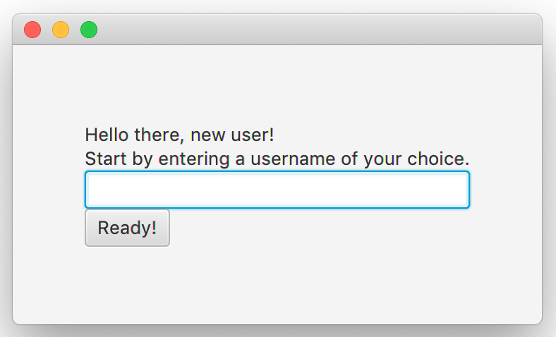
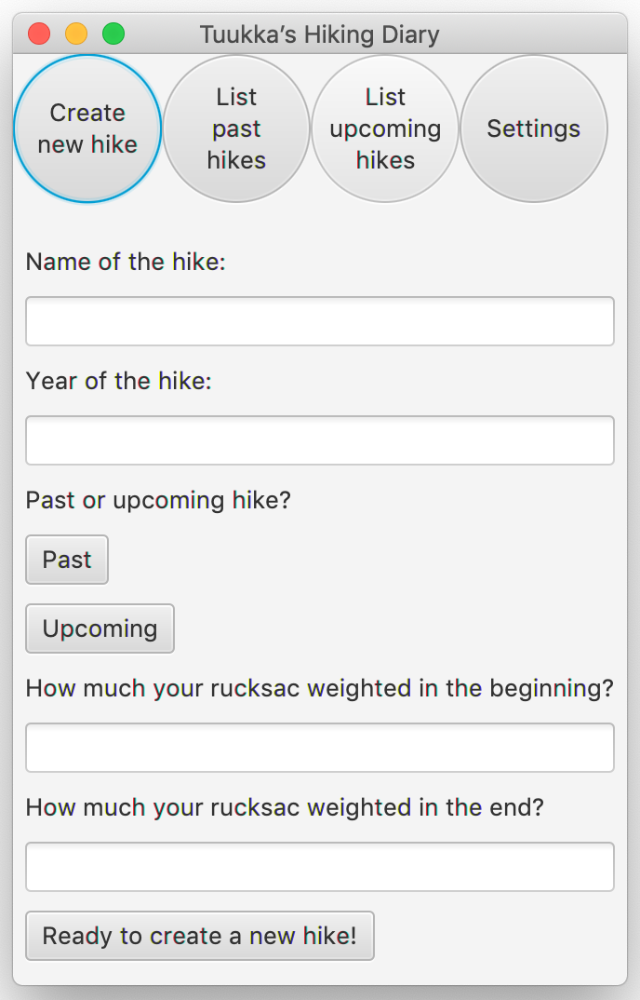

# Käyttöohje

Sovelluksen käyttäminen aloitetaan latamaalla tiedosto vaelluspaivakirja.jar.

## Sovelluksen käynnistäminen

Kun tiedosto on ladattu, ohjelma käynnistetään komennolla

```
tähän komento
```

Kun sovellusta käytetään ensimmäistä kertaa, avautuu aluksi näkymä, jossa käyttäjän tulee valita itselleen haluamansa käyttäjänimi (_username_). Tämän jälkeen avautuu päävalikkonäkymä.



Kun sovellus seuraavan kerran avataan, avautuu suoraan päävalikkonäkymä. Päävalikkopalkki pysyy ikkunan yläreunassa koko sovelluksen käytön ajan ja sen avulla voi navigoida nappia painamalla neljään suuntaan: luomaan uutta vaellusta, tarkastelemaan menneitä tai tulevia vaelluksia sekä käyttäjäkohtaisiin asetuksiin.

## Uuden vaelluksen luominen

Uuden vaelluksen luominen alkaa vaelluksen nimeämisellä sekä vaellusvuoden määrittämisellä. Nämä tiedot käyttäjän tulee kirjoittaa näkymässä oleviin tekstikenttiin. Lisäksi vaellukselle tulee määrittää sopivaa nappia painamalla tieto siitä, onko se tuleva vai mennyt vaellus. 

Halutessaan käyttäjä voi myös lisätä vaellukselle tiedon siitä, kuinka paljon hänen rinkkansa painoi vaelluksen alussa ja lopussa. Tämä tapahtuu syöttämällä paino tekstikenttään. Käyttäjän on hyvä huomioida, että muissa kuin tasakiloissa desimaalien erottelussa tulee käyttää pistettä pilkun sijaan.



Kun kaikki tiedot on syötetty, tulee käyttäjän painaa ruudun alaosassa olevaa "Ready to create a new hike!" -nappia, jolloin (mikäli tiedot on annettu oikein) vaellus tallentuu ja käyttäjä voi syöttää seuraavan vaelluksen.

## Menneiden vaellusten tarkastelu

## Tulevien vaellusten tarkastelu

## Asetukset
