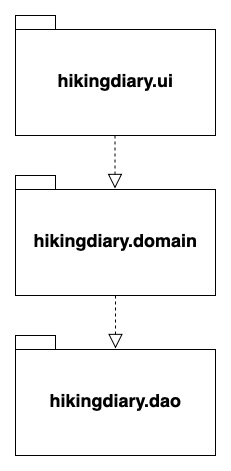
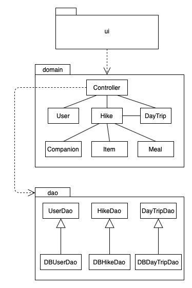
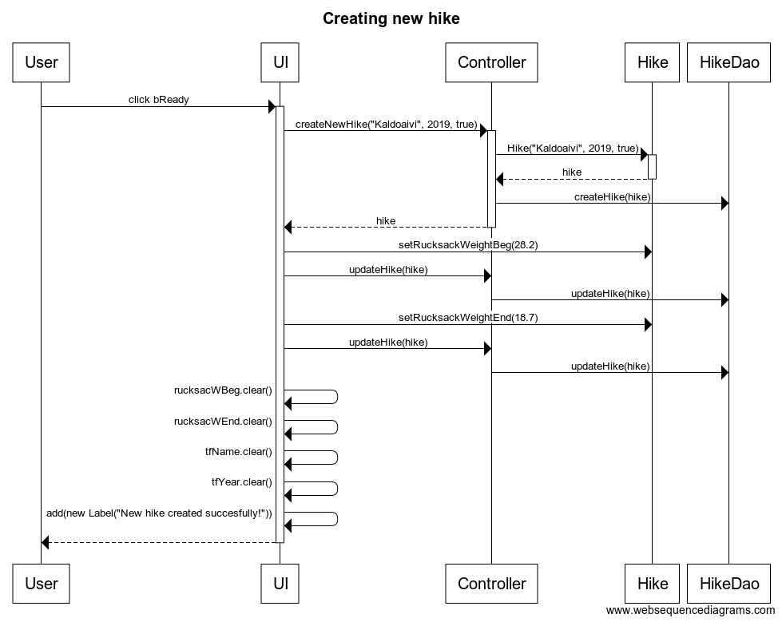

# Sovellusarkkitehtuuri

## Rakenne
Ohjelman rakenne noudattaa kolmitasoista kerrosarkkitehtuuria. Lähdekoodin pakkausrakenne on niin ikään kolmiosainen:

Pakkauksessa hikingdiary.ui on sekä tekstikäyttöliittymän että JavaFX:llä toteutettu graafisen käyttöliittymän lähdekoodi. Pakkauksessa hikingdiary.domain sisältää ohjelman sovelluslogiikan. Pakkauksessa hikingdiary.dao oleva lähdekoodi taas hoitaa ohjelmaan liittyvän pysyväistalletuksen.

## Käyttöliittymä
Käyttöliittymässä on useita eri näkymiä. Kun sovellus käynnistetään ensimmäisen kerran, avautuu aloitusnäkymä, jossa käyttäjää pyydetään valitsemaan käyttäjänimi. Tämän jälkeen – sekä jatkossa aina sovellusta avattaessa – avautuu päävalikkonäkymä, josta pääsee navigoimaan neljään eri suuntaan:

* Mikäli käyttäjä valitsee uuden vaelluksen luomisen, pyydetään käyttäjältä luotavan vaelluksen perustietoja (nimi, ajankohta, kuuluuko vaellus tuleviin vai menneisiin vaelluksiin)
* Mikäli käyttäjä valitsee menneiden tai tulevien vaellusten listauksen, näytetään käyttäjälle lista tämän tallentamista menneistä tai tulevista vaelluksista. Jonkin tietyn vaelluksen valitsemalla aukeaa näkymä vaellukseen tallennetuista tiedoista. Yhden vaelluksen tiedot näyttävästä näkymästä taas pääsee eteenpäin tarkastelemaan ja muokkaamaan kyseisen vaelluksen varuste- ja ruokalistoja sekä seuralaisia.
* Mikäli käyttäjä valitsee Asetukset, hän pääsee muuttamaan käyttäjänimeään.

## Sovelluslogiikka

_Tähän sanallinen kuvaus sovelluslogiikasta_

## Tietojen pysyväistalletus

Pakkauksessa hikingdiary.dao olevat luokat UserDao, HikeDao ja DayTripDao vastaavat vaellusten ja käyttäjänimen pysyväistallennuksesta tallettamalla tiedot tietokantaan. Luokat noudattavat Data Access Object -suunnittelumallia.

## Toiminnallisuus

Alla olevassa sekvenssikaaviossa kuvataan yksi sovelluksen päätoiminnallisuuksista: uuden vaelluksen luominen sen toiminnallisuuden osalta, jonka sovellus tällä hetkellä tarjoaa. Vaelluksen luominen alkaa siitä, että käyttäjä on syöttänyt CreateHikeView-näkymässä näkyvälle lomakkeelle vaelluksen tiedot tekstikenttiin ja valinnut vaelluksen kuuluvan "Tulevat vaellukset" -kategoriaan. 

Kun käyttäjä painaa "Ready to create a new hike!"-nappia, tapahtumat etenevät seuraavasti: 

UserInterface-luokan (UI) olio kutsuu tapahtumien käsittelystä vastaava Controller-oliota, joka puolestaan kutsuu Hike-luokkaa saaden paluuarvona uuden Hike-olion. Tällä oliolla Controller kutsuu HikeDao-luokan vaelluksenluomismetodia ja palauttaa lopuksi hetki sitten syntyneen hike-olion UI:lle. Tämä tarkastaa, onko käyttäjä antanut vaellukselle rinkan alku- ja loppupainot, ja mikäli on, ne lisätään tähän uuteen vaellukseen: Ensin UI kutsuu Hike-luokkaa, joka päivittää painot vaelluksen tietoihin. Tämän jälkeen se kutsuu Controlleria, joka puolestaan kutsuu HikeDaoa päivittääkseen rinkanpainot myös tietokantaan.

Lopuksi tyhjennetään lomakkeen tekstikentät ja näytetään käyttäjälle teksti "New hike created succesfully!".
