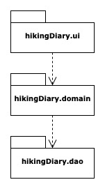
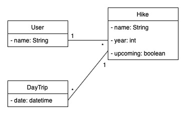

# Sovellusarkkitehtuuri

## Rakenne
Ohjelman rakenne noudattaa kolmitasoista kerrosarkkitehtuuria. Lähdekoodin pakkausrakenne on niin ikään kolmiosainen:

Pakkauksessa hikingDiary.ui on sekä tekstikäyttöliittymän että JavaFX:llä toteutettu graafisen käyttöliittymän lähdekoodi. Pakkauksessa hikingDiary.domain sisältää ohjelman sovelluslogiikan. Pakkauksessa hikingDiary.dao oleva lähdekoodi taas hoitaa ohjelmaan liittyvän pysyväistalletuksen.

## Käyttöliittymä
Käyttöliittymässä on useita eri näkymiä. Kun sovellus käynnistetään, avautuu aloitusnäkymä, josta pääsee navigoimaan viiteen eri suuntaan:

* Mikäli käyttäjä valitsee uuden vaelluksen luomisen, pyydetään käyttäjältä luotavan vaelluksen perustietoja (nimi, ajankohta, kuuluuko vaellus tuleviin vai menneisiin vaelluksiin)
* Mikäli käyttäjä valitsee menneiden tai tulevien vaellusten listauksen, näytetään käyttäjälle lista tämän tallentamista menneistä tai tulevista vaelluksista. Jonkin tietyn vaelluksen valitsemalla aukeaa näkymä vaellukseen tallennetuista tiedoista. 
* Mikäli käyttäjä valitsee Asetukset, hän pääsee muuttamaan käyttäjänimeään.
* Mikäil käyttäjä valitsee poistumisen, kysytään varmistusta ja lopulta suljetaan sovellus.

## Sovelluslogiikka

_Tähän sanallinen kuvaus sovelluslogiikasta_

## Tietojen pysyväistalletus

_Tähän kuvaus pysyväistalletuksesta_
