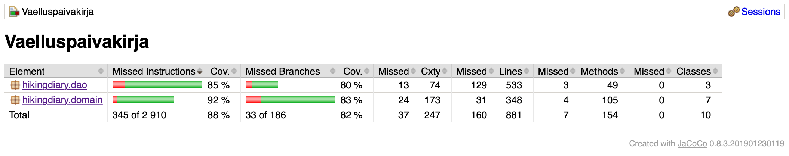

# Testaus

Vaelluspäiväkirja-sovelluksen toteutettua toiminnallisuutta on testattu automatisoiduilla yksikkö- ja integaatiotesteillä käyttämällä JUnitia. Lisäksi toiminnallisuuden tarkoituksenmukaisuutta, käyttöliittymää ja käytettävyyttä on testattu manuaalisesti useamman ihmisen toimesta.

## Yksikkö- ja integraatiotestaus

Sovelluslogiikkan luokkia testaavat testiluokat ControllerTest, DayTripTest, HikeTest ja MealTest. Näistä ensinmainittu testaa myös eri luokkien yhteistoimintaa (integraatiotestit) niin hikingdiary.dao- kuin hikingdiary.domain-pakkauksenkin luokille. Testatessaan metodejaan, jotka kutsuvat tiedon pysyväistalletuksesta vastaavia luokkia, Controller käyttää testaamisessa oliota, joka tallentaa tiedot testitiedostoon. Testien jälkeen testitiedosto poistetaan.

Tiedon pysyväistalletusta tietokantaan ja tiedon sieltä hakemista testaavat luokat DBHikeDaoTest, DBUserDaoTest ja DBDayTripDaoTest. Nämä testiluokat tallentavat tiedot testien ajaksi tietokantatiedostoon, joka poistetaan testien ajamisen jälkeen.

## Testauskattavuus

Testit ovat tähän mennessä toteutetun sovelluslogiikan osalta kattavat. Rivi- ja haarautuvuuskattavuus ovat yli 80%. Testien ulkopuolelle jäivät paitsi yksinkertaiset get- ja set-metodit, jotka eivät sattuneet muiden testien osaksi, myös esimerkiksi tilanteet, jossa tietokantayhteys ei toimi oikein.

## Järjestelmätestaus

Järjestelmätestausta teki kolme ihmistä manuaalisesti. Testausta tehtiin kaikelle tähän mennessä toteutetulle toiminnallisuudelle, joka on kuvattu määrittelydokumentissa. Testauksessa tekstikentille annettin kaikenlaisia – myös tyypiltää vääriä tai tyhjiä – syötteitä. On mahdollista, että huolellisesta testauksesta huolimatta sovellukseen on jäänyt joitakin aukkoja virhetilanteiden käsittelyssä. Mikäli tällaisia havaitaan, sovelluksen tekijä ottaa mielellään vastaan huomioita näistä.

## Sovelluksen laatu ja käytettävyys

Sovellus tarvitsee vielä muutamia toiminnallisuuksia, jotta sen käyttäminen olisi miellyttävää ja käytännöllistä. Tällä hetkellä alunperin tulevaksi vaellukseksi merkittyä vaellusta ei ole myöhemmin mahdollista muuttaa menneeksi, eikä päivämatkoja pysty poistamaan vaellukselta. Nämä sekä mahdollisesti muita [README-dokumentissa](https://github.com/veelupu/ot-harjoitustyo/blob/master/README.md) esitellyt toiminnallisuudet pyritään toteuttamaan tulevaisuudessa.
